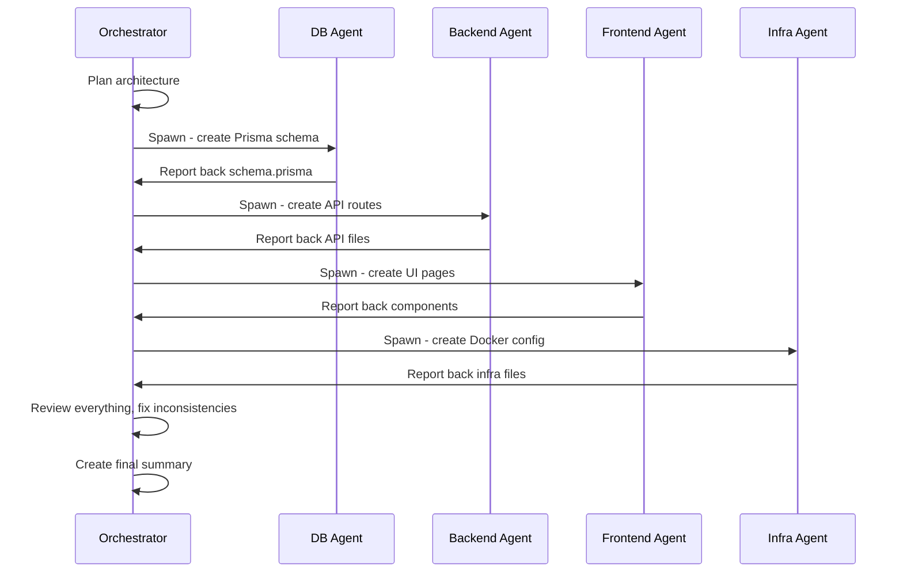

# Dev Bookmarks — Architecture Plan

## TL;DR
Personal bookmark app untuk developers. Simpan link (docs, tools, articles, GitHub repos), AI auto-tag everything. Browse by tag, search, done. **Single-user, no auth.**

---

## User Flow
```
1. Buka dashboard → see all bookmarks
2. Click "Add" → paste URL → AI fetch title/description → AI auto-tag → Save
3. Filter by tag / search by title/URL → instant filter
4. Click card → open URL in new tab
```

---

## Project Structure

```
dev-bookmarks/
├── prisma/
│   └── schema.prisma              # Schema + migrations
│
├── src/
│   ├── app/
│   │   ├── api/
│   │   │   └── bookmarks/         # CRUD bookmarks
│   │   │       ├── route.ts       #   GET /api/bookmarks, POST /api/bookmarks
│   │   │       └── [id]/route.ts  #   DELETE /api/bookmarks/[id]
│   │   ├── dashboard/
│   │   │   └── page.tsx
│   │   ├── add/
│   │   │   └── page.tsx
│   │   └── layout.tsx
│   │
│   ├── components/
│   │   ├── BookmarkCard.tsx
│   │   ├── TagFilter.tsx
│   │   ├── SearchBar.tsx
│   │   └── AddBookmarkForm.tsx
│   │
│   └── lib/
│       ├── prisma.ts               # Prisma client
│       └── ai-tagger.ts            # AI tagging via OpenRouter
│
├── public/
├── .env.example
├── .gitignore
├── package.json
├── tsconfig.json
└── next.config.ts
```

---

## Tech Stack

| Layer        | Choice                   | Why                                   |
|-------------|--------------------------|---------------------------------------|
| Framework   | Next.js 15 (App Router)  | Single repo for frontend + backend    |
| Language    | TypeScript               | Type safety everywhere                |
| Database    | SQLite (via Prisma)      | Zero setup, single file, no Docker    |
| ORM         | Prisma                   | Type-safe, easy migrations            |
| Auth        | None                     | Single-user app, no need              |
| AI Tagging  | OpenRouter (Gemini Flash)| Free tier, low latency                |
| Styling     | Tailwind CSS v4          | Rapid UI, responsive                  |
| Deploy      | Vercel or `next start`   | Simple, no Docker needed              |

---

## DB Schema

```prisma
model Bookmark {
  id          String   @id @default(cuid())
  url         String
  title       String?
  description String?
  tags        String   // Comma-separated tag string for SQLite
  favicon     String?
  createdAt   DateTime @default(now())
}

model Tag {
  id        String   @id @default(cuid())
  name      String   @unique
  count     Int      @default(1)
  createdAt DateTime @default(now())
}
```

---

## AI Tagging Flow

```
User pastes URL
       │
       ▼
Fetch URL metadata (title, description, favicon) via OpenGraph
       │
       ▼
Send title + description to OpenRouter (Gemini Flash):
  Prompt: "Given this dev resource titled 'X' describing 'Y',
           suggest 2-5 relevant tech tags from this list:
           [react, nextjs, typescript, node, python, docker, css,
            database, api, testing, devops, ai, frontend, backend,
            mobile, security, performance, tooling, javascript, go,
            rust, graphql, aws, linux, git, other]
           Return ONLY comma-separated tags."
       │
       ▼
Parse response → save tags to DB (Bookmark.tags + update Tag counts)
       │
       ▼
Display in dashboard with tag pills
```

---

## API Routes

| Method | Endpoint                  | Description                        |
|--------|---------------------------|------------------------------------|
| POST   | /api/bookmarks            | Create bookmark (+ AI tag)         |
| GET    | /api/bookmarks            | List bookmarks (all / filter by tag)|
| DELETE | /api/bookmarks/[id]       | Delete bookmark                    |

---

## Frontend Pages

| Route        | Component            | Description                        |
|-------------|----------------------|------------------------------------|
| /dashboard  | DashboardPage        | All bookmarks, tag filter, search  |
| /add        | AddBookmarkForm      | Paste URL, AI fetches + tags       |

---

## Dev Workflow

### Local Dev (fast iteration)
```bash
# Terminal 1: PostgreSQL via Docker
docker run --name devmark-db -e POSTGRES_USER=devmark -e POSTGRES_PASSWORD=*** -e POSTGRES_DB=devmark -p 5432:5432 -d postgres:16-alpine

# Terminal 2: Next.js dev server (hot reload)
npm run dev
# → http://localhost:3000
```

### Production Build (docker compose)
```bash
docker compose up --build
# → http://localhost:3000
```

---

## Subagent Execution Plan (untuk Claude Code)



---

## Why This is LinkedIn-Worthy

| Zanko said               | What I built               |
|--------------------------|----------------------------|
| "Not ready for AI dev"   | Multi-agent system with AI |
| "Stay with CI4"          | Next.js + modern stack     |
| "Just do junior work"    | Designed system architecture|
| "Follow instructions"    | Orchestrated 5 agents      |

The narrative sells itself.
