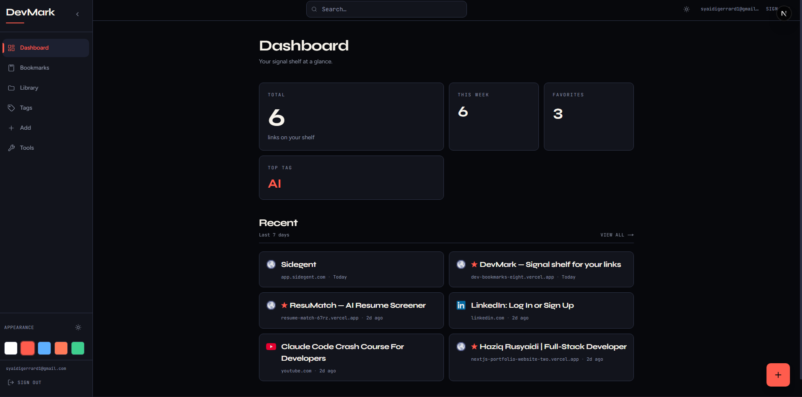
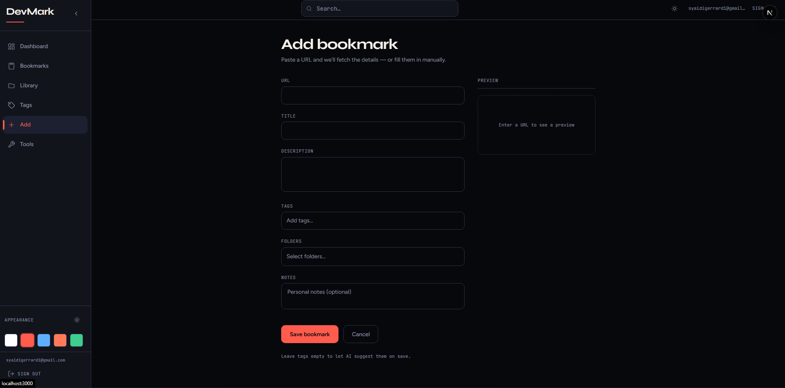

# DevMark

A bookmark manager I built for my own use — save a link, let AI tag it, find it again by tag, folder, or search. No sign-up flow, no multi-tenant complexity: it's a single-user app locked to one email, so all the effort goes into the actual workflow instead of accounts.

**Live:** [dev-bookmarks-eight.vercel.app](https://dev-bookmarks-eight.vercel.app)

## Screenshots

| Dashboard | Add bookmark |
|---|---|---|
|  |  |

## Why

I kept losing track of dev articles, docs, and tools in browser bookmark folders I'd never open again. This is the tool I wanted: paste a URL, get metadata and tags automatically, and actually be able to find things later by tag, folder, or free-text search — plus a dead-link check so the collection doesn't quietly rot.

## Features

- **Add bookmarks fast** — paste a URL, metadata (title, description, favicon) is fetched automatically
- **AI auto-tagging** via OpenRouter, with manual retag support
- **Folders** — organize bookmarks into folders, drag-and-drop between them, browse in a dedicated Library view
- **Search & filter** — by tag, by folder, or free-text
- **Favorites & notes** on any bookmark
- **Card / list view toggle**
- **Five themes** (including a pure black-and-white "Mono" mode), each with light/dark variants
- **Tools:** export/import as JSON, bulk retag, dead-link checker
- **Private by design** — single allowed login email, no public sign-up

## Stack

| | |
|---|---|
| Framework | Next.js 16 (App Router) + TypeScript, React 19 |
| Auth | Supabase Auth (email/password, single-user lock) |
| Database | Postgres via Prisma ORM (`@prisma/adapter-pg`) |
| AI | OpenRouter for automatic tagging |
| Styling | Tailwind CSS v4 |
| Hosting | Vercel |

## Local setup

1. Copy env:
   ```bash
   cp .env.example .env
   ```
2. Fill values (see `.env.example`):
   - `DATABASE_URL`
   - `NEXT_PUBLIC_SUPABASE_URL`
   - `NEXT_PUBLIC_SUPABASE_ANON_KEY`
   - `ALLOWED_EMAIL`
   - `OPENROUTER_API_KEY`
   - `NEXT_PUBLIC_APP_URL=http://localhost:3000`
3. Push schema + run:
   ```bash
   npx prisma db push
   npm run dev
   ```
4. Open [http://localhost:3000](http://localhost:3000) → login with your allowed email.

## Deploy (Vercel)

1. Import the GitHub repo into Vercel
2. Add the same env vars (Production + Preview)
3. Set `NEXT_PUBLIC_APP_URL=https://dev-bookmarks-eight.vercel.app`
4. In Supabase Auth → URL Configuration:
   - Site URL: `https://dev-bookmarks-eight.vercel.app`
   - Redirect allow list:
     - `https://dev-bookmarks-eight.vercel.app/auth/callback`
     - `http://localhost:3000/auth/callback`
   - Password recovery uses `/auth/callback?next=/reset-password`

## Scripts

```bash
npm run dev      # local
npm run build    # prisma generate + next build
npm run start    # production server
npm run lint
```

## License

MIT — see [LICENSE](LICENSE).
